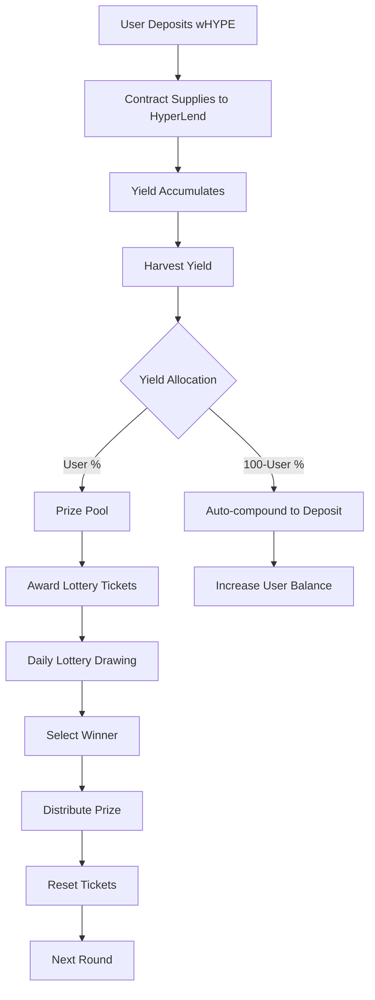

# Technical Specifications

## 📋 Overview

This document provides detailed technical specifications for the HyperLoops protocol, covering architecture decisions, performance characteristics, security models, and implementation details.

## 🏗️ System Architecture

### High-Level Architecture

```
┌─────────────────────────────────────────────────────────────────┐
│                        HyperLoops Ecosystem                     │
├─────────────────────────────────────────────────────────────────┤
│  Frontend (Next.js)                                           │
│  ├── Web3 Integration (Wagmi/Viem)                            │
│  ├── UI Components (NextUI/Tailwind)                          │
│  ├── State Management (TanStack Query)                        │
│  └── Real-time Updates (WebSocket/Polling)                    │
├─────────────────────────────────────────────────────────────────┤
│  Smart Contracts Layer                                         │
│  ├── NoLossLottery.sol (Core Protocol)                        │
│  ├── HyperLend Integration (IPool/IDataProvider)              │
│  └── Security Framework (OpenZeppelin)                        │
├─────────────────────────────────────────────────────────────────┤
│  External Dependencies                                          │
│  ├── HyperLend Protocol (Yield Generation)                    │
│  ├── Hyperliquid EVM (Blockchain Infrastructure)              │
│  └── Randomness System (Pseudo-random + Future VRF)           │
└─────────────────────────────────────────────────────────────────┘
```

### Protocol Flow Diagram



## 🔧 Smart Contract Specifications

### Contract Hierarchy

```
NoLossLottery (Main Contract)
├── Inherits from:
│   ├── ReentrancyGuard (Security)
│   ├── Pausable (Emergency Controls)  
│   └── Ownable (Access Control)
├── Interfaces:
│   ├── IPool (HyperLend Integration)
│   ├── IProtocolDataProvider (Yield Queries)
│   └── IERC20 (Token Interactions)
└── Libraries:
    └── SafeERC20 (Safe Token Operations)
```

### State Variables Analysis

#### Core Protocol State
```solidity
// Immutable addresses (set at deployment)
IPool public immutable hyperLendPool;           // 32 bytes
IProtocolDataProvider public immutable dataProvider; // 32 bytes  
IERC20 public immutable depositToken;           // 32 bytes

// Mutable state (regularly updated)
uint256 public totalDeposits;                  // 32 bytes
uint256 public prizePool;                      // 32 bytes
uint256 public currentRound;                   // 32 bytes
uint256 public totalTickets;                   // 32 bytes
uint256 public nextLotteryTime;                // 32 bytes
uint256 public lastHarvestTime;                // 32 bytes

// Constants (compile-time optimization)
uint256 public constant LOTTERY_INTERVAL = 1 days;    // 86400 seconds
uint256 public constant TICKET_UNIT = 1e16;           // 0.01 wHYPE
```

#### User Data Structures
```solidity
struct UserInfo {
    uint256 depositAmount;      // User's total deposit (32 bytes)
    uint256 depositTime;        // Latest deposit timestamp (32 bytes)  
    uint256 tickets;           // Current lottery tickets (32 bytes)
    uint256 lastTicketUpdate;  // Last ticket award timestamp (32 bytes)
}
// Total: 128 bytes per user

mapping(address => UserInfo) public users;           // User data
mapping(address => uint16) public userAllocationBps; // Yield allocation
mapping(address => bool) public hasEverDeposited;    // Lifetime tracking
mapping(address => bool) public isParticipant;       // Active status
```

#### Lottery System Storage
```solidity
struct LotteryResult {
    uint256 round;              // Round number (32 bytes)
    address winner;             // Winner address (20 bytes + 12 padding)
    uint256 prize;             // Prize amount (32 bytes)
    uint256 totalParticipants; // Participants at draw (32 bytes)
    uint256 totalTicketsAtDraw; // Tickets at draw (32 bytes)
    uint256 timestamp;          // Draw timestamp (32 bytes)
    bytes32 randomSeed;        // Random seed used (32 bytes)
}
// Total: 224 bytes per lottery result

mapping(uint256 => LotteryResult) public lotteryHistory;
address[] public participants;                 // Active participant array
```

### Gas Usage Analysis

#### Function Gas Costs (Estimated)

| Function | Base Gas | Variable Gas | Notes |
|----------|----------|--------------|-------|
| `depositWHYPE()` | ~120,000 | +20,000 first deposit | New participant setup |
| `withdraw()` | ~80,000 | +15,000 if last deposit | Participant cleanup |
| `harvestYield()` | ~50,000 | +5,000 per participant | Scales with participant count |
| `executeLottery()` | ~100,000 | +3,000 per participant | Winner selection cost |
| View functions | ~2,000 | - | Constant cost |

#### Storage Cost Optimization

**Struct Packing:**
```solidity
// Optimized packing (saves gas)
struct UserInfo {
    uint256 depositAmount;      // Slot 0
    uint256 depositTime;        // Slot 1  
    uint256 tickets;           // Slot 2
    uint256 lastTicketUpdate;  // Slot 3
}

// Alternative packed version (future optimization)
struct PackedUserInfo {
    uint128 depositAmount;      // Slot 0 (first half)
    uint64 depositTime;         // Slot 0 (second half, upper)
    uint32 tickets;            // Slot 0 (second half, middle)  
    uint32 lastTicketUpdate;   // Slot 0 (second half, lower)
}
// Saves 3 storage slots per user
```

### Security Model

#### Access Control Matrix

| Function | Public | Owner | Participant | Requirements |
|----------|--------|-------|-------------|--------------|
| `depositWHYPE()` | ✅ | ✅ | ✅ | `whenNotPaused` |
| `withdraw()` | ✅ | ✅ | ✅ | `whenNotPaused` |
| `harvestYield()` | ✅ | ✅ | ✅ | `whenNotPaused` |
| `executeLottery()` | ✅ | ✅ | ✅ | `whenNotPaused` + conditions |
| `pause()` | ❌ | ✅ | ❌ | Owner only |
| `unpause()` | ❌ | ✅ | ❌ | Owner only |
| `fundPrizePool()` | ❌ | ✅ | ❌ | Owner only |
| `rescueERC20()` | ❌ | ✅ | ❌ | Owner only + paused |

#### Security Mechanisms

**Reentrancy Protection:**
```solidity
// All state-changing functions protected
function depositWHYPE(uint256 amount) external nonReentrant whenNotPaused {
    // Effects before interactions pattern
    // 1. Update state variables
    // 2. External calls last
}
```

**Input Validation:**
```solidity
function depositWHYPE(uint256 amount) external nonReentrant whenNotPaused {
    require(amount > 0, "Amount must be greater than 0");
    require(depositToken.balanceOf(msg.sender) >= amount, "Insufficient balance");
    // ... rest of function
}
```

**Emergency Controls:**
```solidity
// Pausable pattern for emergency stops
modifier whenNotPaused() {
    require(!paused(), "Contract is paused");
    _;
}

function pause() external onlyOwner {
    _pause();
}
```

## 🎲 Lottery Algorithm

### Ticket Distribution System

#### Ticket Calculation
```solidity
// Tickets awarded based on yield contribution
function calculateTickets(uint256 yieldContribution) internal pure returns (uint256) {
    uint256 tickets = yieldContribution / TICKET_UNIT; // 0.01 wHYPE per ticket
    return tickets > 0 ? tickets : 1; // Minimum 1 ticket for any contribution
}
```

#### Weight-Based Selection
```solidity
function _selectWinner(uint256 randomValue) internal view returns (address) {
    require(totalTickets > 0, "No tickets");
    
    uint256 target = randomValue % totalTickets;
    uint256 cumulative = 0;
    
    for (uint256 i = 0; i < participants.length; i++) {
        address participant = participants[i];
        uint256 userTickets = users[participant].tickets;
        
        if (userTickets == 0) continue;
        
        cumulative += userTickets;
        if (cumulative > target) {
            return participant;
        }
    }
    
    // Fallback (should not reach)
    return participants[0];
}
```

### Randomness Implementation

#### Current System (Pseudo-Random)
```solidity
function _generateRandomness() internal returns (bytes32) {
    bytes32 seed = keccak256(
        abi.encode(
            blockhash(block.number - 1),    // Previous block hash
            address(this),                  // Contract address  
            currentRound,                   // Current lottery round
            totalTickets,                   // Total active tickets
            lastRandomSeed                  // Previous seed
        )
    );
    lastRandomSeed = seed;
    return seed;
}
```

#### Future Enhancement (Chainlink VRF)
```solidity
// Planned upgrade for secure randomness
import "@chainlink/contracts/src/v0.8/interfaces/VRFCoordinatorV2Interface.sol";

contract NoLossLotteryV2 is VRFConsumerBaseV2 {
    VRFCoordinatorV2Interface COORDINATOR;
    uint64 s_subscriptionId;
    bytes32 keyHash;
    
    function requestRandomness() internal {
        uint256 requestId = COORDINATOR.requestRandomWords(
            keyHash,
            s_subscriptionId,
            3,      // Request confirmations
            100000, // Gas limit
            1       // Number of words
        );
        // Store request for fulfillment
    }
}
```

## 💰 Economic Model

### Yield Distribution Mathematics

#### User Yield Allocation
```solidity
function calculateYieldAllocation(address user, uint256 totalYield) 
    internal view returns (uint256 lotteryPortion, uint256 compoundPortion) {
    
    UserInfo memory userInfo = users[user];
    uint256 userShare = (userInfo.depositAmount * totalYield) / totalDeposits;
    
    uint16 allocationBps = userAllocationBps[user];
    if (allocationBps == 0) allocationBps = 10000; // Default 100%
    
    lotteryPortion = (userShare * allocationBps) / 10000;
    compoundPortion = userShare - lotteryPortion;
}
```

#### Expected Value Calculation

For a user with deposit `D` and allocation `A%`:
- **Daily Yield**: `D × APR / 365`
- **Lottery Contribution**: `Daily Yield × A%`
- **Auto-compound**: `Daily Yield × (100% - A%)`
- **Tickets Earned**: `Lottery Contribution / 0.01`
- **Win Probability**: `User Tickets / Total Tickets`
- **Expected Daily Win**: `Win Probability × Prize Pool`

### APY Projections

#### HyperLend Integration
```typescript
// Theoretical yield calculations
interface YieldProjection {
  baseAPY: number;        // HyperLend lending rate (5-20%)
  utilizationRate: number; // Pool utilization (affects APY)
  compoundFrequency: number; // Daily compounding
  protocolFee: number;    // Currently 0%
}

const calculateProjectedAPY = (projection: YieldProjection): number => {
  const dailyRate = projection.baseAPY / 365;
  const compoundAPY = Math.pow(1 + dailyRate, 365) - 1;
  return compoundAPY * (1 - projection.protocolFee);
};
```

## 📊 Performance Characteristics

### Throughput Analysis

#### Transaction Capacity
- **Deposits**: ~2,000 gas per user (after initial setup)
- **Withdrawals**: ~1,500 gas per user
- **Lottery Execution**: ~100 gas per participant
- **Yield Harvesting**: ~50 gas per participant

#### Scalability Limits
```typescript
// Theoretical limits based on gas constraints
const BLOCK_GAS_LIMIT = 30_000_000; // Hyperliquid EVM
const LOTTERY_GAS_PER_PARTICIPANT = 3_000;

const maxParticipants = Math.floor(BLOCK_GAS_LIMIT / LOTTERY_GAS_PER_PARTICIPANT);
// ~10,000 participants per lottery execution
```

### Storage Efficiency

#### Data Storage Costs
```solidity
// Storage slot costs (20,000 gas for new, 5,000 for update)
mapping(address => UserInfo) public users;           // 4 slots per user
mapping(address => uint16) public userAllocationBps; // 1 slot per user  
mapping(address => bool) public isParticipant;       // 1 slot per user
address[] public participants;                        // 1 slot per participant
```

#### Memory Optimization Strategies
1. **Struct Packing**: Reduce storage slots
2. **Lazy Loading**: Load data only when needed
3. **Event Indexing**: Use events for historical data
4. **IPFS Integration**: Store large datasets off-chain

### Network Performance

#### Hyperliquid EVM Characteristics
- **Block Time**: ~1 second
- **Finality**: ~2-3 seconds  
- **Gas Price**: Variable, typically low
- **TPS**: ~1000+ transactions per second

#### Frontend Performance Targets
- **Initial Load**: <3 seconds
- **Contract Interaction**: <1 second response
- **Data Updates**: 30-second intervals
- **Mobile Performance**: 60fps animations

## 🔐 Security Analysis

### Threat Model

#### Attack Vectors & Mitigations

**Flash Loan Attacks:**
- **Risk**: Manipulate yield calculations
- **Mitigation**: Time-weighted deposits, gradual yield accrual

**Front-Running:**
- **Risk**: MEV extraction on lottery execution
- **Mitigation**: Commit-reveal scheme (future), randomness delay

**Governance Attacks:**
- **Risk**: Malicious owner actions
- **Mitigation**: Multi-sig ownership, time locks

**Smart Contract Bugs:**
- **Risk**: Logic errors, reentrancy
- **Mitigation**: Comprehensive testing, formal verification

#### Audit Recommendations

```solidity
// Critical security patterns implemented
contract NoLossLottery is ReentrancyGuard, Pausable, Ownable {
    using SafeERC20 for IERC20; // Safe token operations
    
    modifier validAmount(uint256 amount) {
        require(amount > 0, "Invalid amount");
        _;
    }
    
    modifier onlyParticipant() {
        require(users[msg.sender].depositAmount > 0, "Not participant");
        _;
    }
}
```

### Formal Verification Targets

#### Properties to Verify
1. **Invariants:**
   - `totalDeposits <= getCurrentSupplyBalance()`
   - `sum(user.depositAmount) == totalDeposits`
   - `sum(user.tickets) == totalTickets`

2. **Safety Properties:**
   - Users can always withdraw their deposits
   - Prize pool is distributed fairly
   - No funds can be lost or stolen

3. **Liveness Properties:**
   - Lottery executes when conditions are met
   - Yield harvesting progresses state
   - System remains operational

## 🔧 Technical Integration

### HyperLend Integration Specifications

#### Interface Compliance
```solidity
// Aave V3 compatible interface implementation
interface IPoolCompatible {
    function supply(address asset, uint256 amount, address onBehalfOf, uint16 referralCode) external;
    function withdraw(address asset, uint256 amount, address to) external returns (uint256);
}

// Data provider for yield calculations
interface IDataProviderCompatible {
    function getUserReserveData(address asset, address user) 
        external view returns (uint256 currentHTokenBalance, ...);
}
```

#### Error Handling
```solidity
function supplyToHyperLend(uint256 amount) internal {
    try hyperLendPool.supply(address(depositToken), amount, address(this), 0) {
        emit SupplySuccessful(amount);
    } catch Error(string memory reason) {
        emit SupplyFailed(amount, reason);
        revert("HyperLend supply failed");
    }
}
```

### Frontend Architecture

#### Web3 Integration Stack
```typescript
// Complete integration configuration
import { configureChains, createConfig } from 'wagmi';
import { hyperEVM, hyperEVMTestnet } from './chains';
import { alchemyProvider, publicProvider } from 'wagmi/providers';

const { chains, publicClient } = configureChains(
    [hyperEVM, hyperEVMTestnet],
    [
        alchemyProvider({ apiKey: process.env.ALCHEMY_ID }),
        publicProvider()
    ]
);
```

#### State Management Architecture
```typescript
// Centralized contract state management
interface ContractState {
    // Core metrics
    totalDeposits: bigint;
    prizePool: bigint;
    currentRound: bigint;
    participantCount: number;
    nextLotteryTime: bigint;
    
    // User data
    userInfo: UserInfo | null;
    userTickets: bigint;
    userAllocation: number;
    
    // System status
    isPaused: boolean;
    isLotteryReady: boolean;
    accruedYield: bigint;
}
```

## 📈 Monitoring & Analytics

### Key Metrics

#### Protocol Health Metrics
```typescript
interface ProtocolMetrics {
    // Financial metrics
    totalValueLocked: bigint;
    dailyVolume: bigint;
    yieldGenerated: bigint;
    prizesDistributed: bigint;
    
    // User metrics  
    activeParticipants: number;
    lifetimeDepositors: number;
    averageDepositSize: bigint;
    retentionRate: number;
    
    // Performance metrics
    averageBlockTime: number;
    transactionSuccessRate: number;
    gasUsageEfficiency: number;
    
    // Yield metrics
    currentAPY: number;
    hyperLendUtilization: number;
    yieldDistributionRatio: number;
}
```

#### Alerting Thresholds
```typescript
const ALERT_THRESHOLDS = {
    lowLiquidity: parseEther("1000"),      // Alert if TVL < 1000 wHYPE
    highGasUsage: 1_000_000,               // Alert if gas > 1M per tx
    stakingImbalance: 0.95,                // Alert if utilization > 95%
    contractPaused: true,                  // Alert if contract paused
    failedTransactions: 0.05,              // Alert if >5% tx failure rate
};
```

### Observability Stack

#### Event Logging
```solidity
// Comprehensive event system for monitoring
event MetricsUpdated(
    uint256 indexed timestamp,
    uint256 totalDeposits,
    uint256 prizePool,
    uint256 participantCount,
    uint256 accruedYield
);

event UserAction(
    address indexed user,
    string action,
    uint256 amount,
    uint256 timestamp,
    bytes32 txHash
);
```

#### Off-chain Analytics
```typescript
// Data aggregation service
class ProtocolAnalytics {
    async calculateTVLHistory(timeRange: TimeRange): Promise<TVLDataPoint[]> {
        const events = await this.queryDepositEvents(timeRange);
        return this.aggregateByTime(events);
    }
    
    async generateYieldReport(): Promise<YieldReport> {
        return {
            totalYield: await this.getTotalYieldGenerated(),
            distributionBreakdown: await this.getYieldDistribution(),
            efficiencyMetrics: await this.calculateEfficiency(),
        };
    }
}
```

---

**This completes the core technical documentation. The specifications provide a comprehensive foundation for understanding, deploying, and maintaining the HyperLoops protocol.**