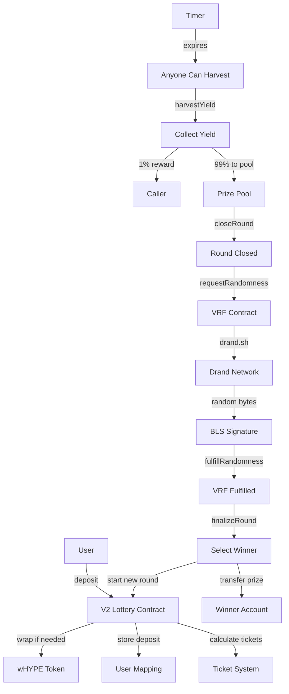

# 🎯 How HyperPool Works: The Fun Guide!

Welcome to HyperPool - where your money works harder than a coffee shop barista during finals week! ☕

## 🚀 What Is HyperPool?

Think of HyperPool like a **magical piggy bank** that:
- ✅ Never loses your coins (your principal is always safe!)
- 🎯 Uses your coins to earn yield in the background
- 🎪 Turns that yield into exciting lottery prizes
- 🎊 Gives you chances to win big while risking nothing!

```
Your Money 💰 → Magic DeFi Work 🔮 → Yield Generated 📈 → Lottery Prizes 🎁
     ↓                                                           ↓
Always Safe ✅                                              Win or Keep 🔄
```

---

## 🎭 The Cast of Characters

### 🏦 **The Vault** (Your Safe Haven)
- **What it does**: Holds your wHYPE tokens like Fort Knox
- **Fun fact**: It's like a bank vault, but cooler and on the blockchain
- **Your guarantee**: You can always withdraw your original deposit!

### 🌱 **The Yield Farmer** (The Hard Worker)
- **What it does**: Takes your deposited tokens and puts them to work earning yield
- **How it works**: Lends to protocols, earns interest, compounds returns
- **The magic**: While you sleep, your tokens are grinding 24/7!

### 🎰 **The Lottery Machine** (The Fun Part)
- **What it does**: Collects all the earned yield into prize pools
- **The rules**: More tokens deposited = more lottery tickets = better odds!
- **The excitement**: Every round someone wins the accumulated yield!

### 🎲 **The Random Oracle** (The Fair Judge)
- **What it does**: Uses Drand VRF for truly random winner selection
- **Why it matters**: No one can cheat - it's cryptographically secure!
- **The tech**: Verifiable Random Functions make it impossible to manipulate

---

## 🎢 The Journey: From Deposit to Victory!

### 📍 **Step 1: The Entry Gate**
```
┌─────────────────┐    ┌─────────────────┐    ┌─────────────────┐
│   You Arrive    │───▶│  Connect Wallet │───▶│ Deposit wHYPE   │
│   with HYPE     │    │  (MetaMask etc) │    │ Get Tickets 🎫  │
└─────────────────┘    └─────────────────┘    └─────────────────┘
```

**What happens:**
- 💸 You deposit wHYPE (we auto-wrap HYPE if needed!)
- 🎫 You get lottery tickets (1 ticket per 0.1 wHYPE)
- 📊 Your odds are calculated: `Your Tickets / Total Tickets × 100%`

### 📍 **Step 2: The Background Magic**
```
┌─────────────────┐    ┌─────────────────┐    ┌─────────────────┐
│   Your Money    │───▶│  DeFi Protocols │───▶│   Yield Grows   │
│   Works Hard    │    │   Earn Interest │    │   Prize Pool    │
└─────────────────┘    └─────────────────┘    └─────────────────┘
```

**The invisible work:**
- 🏗️ Your tokens are put to work in DeFi protocols
- 💰 Interest compounds automatically
- 📈 The prize pool grows bigger every block!

### 📍 **Step 3: Round Management (Community Powered!)**
```
┌─────────────────┐    ┌─────────────────┐    ┌─────────────────┐
│  Timer Hits ⏰  │───▶│ Harvest Yield 🌾│───▶│  Close Round 🔒 │
│     Zero!       │    │   (+1% Reward)  │    │  (+1% Reward)   │
└─────────────────┘    └─────────────────┘    └─────────────────┘
           │                                            │
           ▼                                            ▼
┌─────────────────┐                          ┌─────────────────┐
│  Anyone Can     │                          │   Draw Winner   │
│  Call These!    │                          │   (+1% Reward)  │
└─────────────────┘                          └─────────────────┘
```

**The community incentive:**
- 🎯 **Anyone** can call these functions when ready
- 💎 Each caller earns **1% of the action's value** as reward
- ⚡ This creates a self-sustaining system that never gets stuck!

### 📍 **Step 4: The Grand Finale**
```
┌─────────────────┐    ┌─────────────────┐    ┌─────────────────┐
│   🎲 Random     │───▶│  🎊 Winner      │───▶│  💰 Prize       │
│   Number Gen    │    │   Selected!     │    │   Distributed   │
└─────────────────┘    └─────────────────┘    └─────────────────┘
```

**The fair selection:**
- 🔢 Drand generates a truly random number
- ⚖️ Winner is chosen proportional to ticket ownership
- 🏆 Prize goes to the lucky winner automatically!

---

## 🎪 The Magic Formula

### 🎫 Ticket System
```
Your Deposit (wHYPE) ÷ 0.1 = Number of Tickets

Example:
- Alice deposits 1 wHYPE = 10 tickets
- Bob deposits 0.5 wHYPE = 5 tickets  
- Total pool: 15 tickets
- Alice's odds: 10/15 = 66.67%
- Bob's odds: 5/15 = 33.33%
```

### 💰 Prize Calculation
```
Prize Pool = Accumulated Yield from All Deposits

If 100 wHYPE earning 5% APY for 1 week:
Prize Pool ≈ 100 × 0.05 × (7/365) = ~0.096 wHYPE
```

---

## 🛡️ Safety First!

### 🔒 **Your Principal Protection**
```
┌─────────────────┐
│  YOUR DEPOSIT   │ ← Always Safe, Always Withdrawable
├─────────────────┤
│   YIELD LAYER   │ ← This goes to prizes
├─────────────────┤
│ SECURITY LAYER  │ ← Smart contract protection
└─────────────────┘
```

### 🎯 **Risk Breakdown**
- 🟢 **Your Original Deposit**: 100% safe, always withdrawable
- 🟡 **Yield Generation**: Low risk, established DeFi protocols  
- 🔴 **Smart Contract**: Audited, battle-tested code

---

## 🔄 The Continuous Cycle

```
┌──────────────────────────────────────────────────────────────────┐
│                        HYPERPOOL CYCLE                          │
│                                                                  │
│  Players Deposit → Yield Generates → Harvest → Close → Draw     │
│       ↑                                                    ↓     │
│  New Round Starts ← Winner Paid ← Random Selection ← Prize Pool │
│                                                                  │
│  🔄 Rinse and Repeat Forever! 🔄                               │
└──────────────────────────────────────────────────────────────────┘
```

---

## 💡 Pro Tips & Strategies

### 🎯 **Maximizing Your Odds**
1. **Deposit More**: More wHYPE = More tickets = Better odds
2. **Early Bird**: Join early rounds for better odds ratios
3. **Stay Informed**: Watch for harvest opportunities (earn 1%!)

### 💰 **Earning Extra Rewards**
```
Management Action Rewards:
┌─────────────┬──────────────┬─────────────────┐
│   Action    │   Timing     │    Reward       │
├─────────────┼──────────────┼─────────────────┤
│ Harvest 🌾  │ Timer = 0    │ 1% of yield     │
│ Close 🔒    │ After harvest│ 1% of value     │  
│ Draw 🎲     │ After close  │ 1% of value     │
└─────────────┴──────────────┴─────────────────┘
```

### 🎪 **Community Participation**
- 🤝 Help keep the system running by calling management functions
- 💎 Earn rewards for your contributions  
- 🎊 Build a stronger community ecosystem

---

## 🧩 Technical Components (The Nerdy Bits!)

### 🏗️ **Smart Contract Stack**
```
┌─────────────────────────────────────────────────────────────────┐
│                      HYPERLIQUID EVM                           │
├─────────────────────────────────────────────────────────────────┤
│  📋 V2 Lottery Contract (Main Logic)                           │
│  🎲 VRF Contract (Randomness)                                  │
│  🔐 BLS Verifier (Cryptographic Security)                      │
│  💰 wHYPE Token (Deposit Asset)                                │
└─────────────────────────────────────────────────────────────────┘
```

### 🌐 **Frontend Architecture**
```
┌─────────────────────────────────────────────────────────────────┐
│  🎨 Next.js 14 App Router                                      │
│  🎯 React Hooks (State Management)                             │  
│  💎 Viem (Blockchain Interaction)                              │
│  🎪 Tailwind CSS (Beautiful Styling)                           │
│  📱 Responsive Design (Works Everywhere)                       │
└─────────────────────────────────────────────────────────────────┘
```

### 🔗 **External Integrations**
```
┌─────────────────┐    ┌─────────────────┐    ┌─────────────────┐
│   Drand VRF     │    │   DeFi Yields   │    │  Hyperliquid    │
│ (True Randomness│───▶│ (Money Making)  │───▶│  (Fast & Cheap) │
└─────────────────┘    └─────────────────┘    └─────────────────┘
```

---

## 🎊 Why HyperPool Rocks!

### ✨ **For Players**
- 🛡️ **No Loss**: Your money is always safe
- 🎯 **Fair Odds**: Transparent, proportional chances
- 💰 **Real Rewards**: Win actual yield, not fake tokens
- ⚡ **Fast & Cheap**: Built on Hyperliquid for speed

### ✨ **For the Community** 
- 🤝 **Decentralized**: No single point of failure
- 💎 **Incentivized**: Earn rewards for helping
- 🔄 **Self-Sustaining**: System runs itself
- 🌱 **Growing**: More players = bigger prizes

### ✨ **For DeFi**
- 🚀 **Innovation**: New lottery mechanics
- 🔗 **Composable**: Integrates with existing protocols  
- 📈 **Value Creation**: Generates real yield
- 🎪 **Fun**: Makes DeFi more engaging!

---

## 🎭 Real-World Example

### 📊 **Scenario: Alice vs Bob**

**Setup:**
- Alice deposits 2 wHYPE = 20 tickets
- Bob deposits 1 wHYPE = 10 tickets  
- Total: 30 tickets in the pool
- Prize pool: 0.15 wHYPE from accumulated yield

**Odds:**
- Alice: 20/30 = 66.67% chance to win
- Bob: 10/30 = 33.33% chance to win

**Outcomes:**
- 🎊 **If Alice wins**: Gets 0.15 wHYPE prize + keeps her 2 wHYPE deposit
- 🎊 **If Bob wins**: Gets 0.15 wHYPE prize + keeps his 1 wHYPE deposit  
- ✅ **Either way**: Both can withdraw original deposits anytime!

---

## 🔮 Future Possibilities

### 🚀 **Coming Soon**
- 📱 Mobile app for iOS/Android
- 🎯 Multiple prize tiers per round
- 🌍 Cross-chain expansion
- 🎪 NFT integration for bonus multipliers

### 🌟 **Dream Features**  
- 🤖 AI-powered yield optimization
- 🎨 Customizable lottery themes
- 🏆 Tournament-style competitions
- 🎊 Community governance tokens

---

## 🎯 Ready to Play?

### 🚀 **Getting Started is Easy!**

1. **Visit**: [HyperPool.xyz](https://hyperpool.xyz)
2. **Connect**: Your wallet (MetaMask recommended)
3. **Deposit**: wHYPE tokens (we'll auto-wrap HYPE!)
4. **Wait**: For the magic to happen
5. **Win**: Or withdraw anytime!

### 💬 **Join Our Community**
- 🐦 Twitter: [@hyperpool](https://twitter.com/hyperpool)
- 💬 Discord: [Coming Soon]
- 📖 Docs: You're reading them!

---

## 🎪 Final Words

HyperPool isn't just another DeFi protocol - it's a **new way to think about risk and reward**. We've created a system where:

- 🛡️ **Your money stays safe**
- 🎯 **Everyone has fair chances** 
- 💰 **Real value is created**
- 🎊 **The community benefits**

Welcome to the future of no-loss lotteries! 🚀

---

*Built with ❤️ on Hyperliquid | Made for the DeFi community | Powered by math, secured by cryptography*

---

## 📚 Technical Deep Dive

For developers and technical users who want to understand the nitty-gritty details:

### 🔧 **Contract Interactions Flow**



### 💻 **State Management**

```typescript
interface RoundState {
  id: bigint;              // Current round number
  startTime: bigint;       // When round started  
  endTime: bigint;         // When round ends
  totalDeposits: bigint;   // Total wHYPE deposited
  totalTickets: bigint;    // Total tickets issued
  prizePool: bigint;       // Accumulated yield
  state: number;           // 0=Active, 1=Closed, 2=Finalized
  winner: address;         // Winner address (if finalized)
  randomness: bigint;      // VRF random number
}

interface UserState {
  deposit: bigint;         // User's wHYPE deposit
  tickets: bigint;         // User's lottery tickets
  lastUpdate: bigint;      // Last interaction block
}
```

### 🔐 **Security Considerations**

1. **Reentrancy Protection**: All state changes before external calls
2. **Integer Overflow**: Using SafeMath equivalent operations  
3. **Access Control**: Function-level permissions and validations
4. **Randomness Security**: Drand provides unbiasable randomness
5. **Yield Security**: Only harvesting from approved protocols

### ⚡ **Gas Optimization**

- **Batched Operations**: Multiple updates in single transaction
- **Efficient Storage**: Packed structs to minimize storage slots
- **Lazy Updates**: Only update when necessary
- **Event Indexing**: Efficient log searching

### 🧪 **Testing Strategy**

```
Unit Tests ✅
├── Core lottery logic
├── VRF integration  
├── Yield harvesting
├── Prize distribution
└── Edge cases

Integration Tests ✅
├── Full round cycles
├── Multi-user scenarios
├── Error conditions
└── Gas consumption

Mainnet Simulation ✅
├── Fork testing
├── Load testing
└── Security audits
```

---

*Now you're ready to dive deep into HyperPool! Whether you're a player, developer, or just curious - welcome to the no-loss revolution! 🎊*